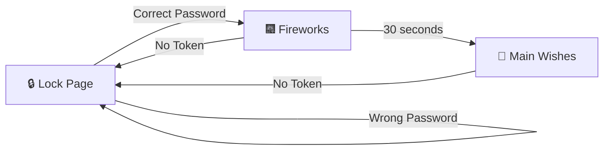

# 💖 Premii's Birthday Surprise 2026 🎂

<div align="center">


_A deeply romantic, interactive birthday experience crafted with pure love_ 💝

[✨ About](#-about) • [🎨 Features](#-features) • [🎯 Journey Flow](#-journey-flow) • [💻 Tech Stack](#-tech-stack) • [📜 License](#-license)

---

### _"Every line of code whispers your name, every animation beats with my heart"_ 💕

</div>

## 🌸 About

This is not just a website, it's a **love letter written in code**, a celebration of **Premii's (Farzana Hossain Lopa)** special day, and a testament to our beautiful journey together. 

> “You are the poem my soul keeps writing
> even when my hands are still.

Created with endless love by **Your Jamai, Your Baby** 💑

### ✨ What Makes This Special

This multi-page interactive birthday experience features:

- 🔐 **Encrypted Lock Page** - Password-protected entry with cosmic hints
- 🎉 **Birthday Wish Page** - Fireworks, floating hearts & animated greetings
- 🎈 **Balloon Popping Game** - Interactive game revealing romantic messages
- 💖 **Wishes Gallery** - Our love story timeline with cinematic video
- 🎂 **Interactive Cake** - Virtual cake cutting with celebratory confetti
- 💌 **Love Letter Modal** - Heartfelt message in beautiful glassmorphism design

---

## 🎯 Journey Flow

```
                    ┌─────────────────┐
         ┌─────────►│  Correct        │
         │          │  Password       │
         │          └────────┬────────┘
         │                   │
         │                   ▼
         │          ┌─────────────────┐
         │          │   🎆 Fireworks  │◄─── No Token
         │          │   (wish.html)   │
         │          │   30 seconds    │
         │          └────────┬────────┘
         │                   │
    ┌────┴──────┐            ▼
    │ 🔒 Lock   │   ┌─────────────────┐
    │   Page    │   │ 🎈 Balloon Game │
    │(index.html)│  │ (balloon.html)  │
    └────┬──────┘   └────────┬────────┘
         │                   │
         │ Wrong             ▼
         │ Password  ┌─────────────────┐
         └───────────┤ 💖 Main Wishes  │◄─── No Token
                     │ (wishes.html)   │
                     │                 │
                     │  ┌───────────┐  │
                     │  │ 🎂 Cake   │  │
                     │  │(cake.html)│  │
                     │  └─────┬─────┘  │
                     │        │        │
                     │        └────────┘
                     └─────────────────┘
```

**Flow Description:**

1. **🔒 Lock Page** - Enter password to unlock (ONLY unprotected page)
   - ✅ Correct Password → Creates session token → Fireworks page
   - ❌ Wrong Password → Error popup appears, stays on lock page
2. **🎆 Fireworks** - Auto-plays for 30 seconds → Balloon game
   - ⚠️ No Token → Redirects to lock page (PROTECTED)
3. **🎈 Balloon Game** - Pop all balloons → Main wishes
   - ⚠️ No Token → Redirects to lock page (PROTECTED)
4. **💖 Main Wishes** - Explore story, video, gift box
   - ⚠️ No Token → Redirects to lock page (PROTECTED)
   - 🎂 Click "Make a Wish!" → Cake page
5. **🎂 Cake** - Cut the cake → Returns to main wishes
   - ⚠️ No Token → Redirects to lock page (PROTECTED)

---

## 🎨 Features

### 🔐 **Secret Lock Page** (`index.html`)

**Visual Effects:**

- 💗 Animated gradient background with pulsing effects
- ✨ 100+ floating hearts rising from bottom
- ⭐ Sparkles appearing randomly across screen
- 🌟 Rotating gradient glow behind card
- 💫 Logo with floating animation and rotating sparkle

**Features:**

- SHA-256 encrypted password protection
- Cosmic code hint: "10-digit code from our special date"
- Eye toggle for password visibility (animated blink)
- Glassmorphism card with backdrop blur
- Enhanced input with glow effects on focus
- Gradient unlock button with ripple effect
- Session-based access token management
- Beautiful error popup with gradient styling

**Technical Highlights:**

- Responsive design (1024px, 768px, 480px breakpoints)
- Continuous particle generation (hearts & sparkles)
- Smooth CSS animations and transitions

---

### 🎉 **Birthday Wish Page** (`wish.html`)

**Visual Effects:**

- 🌟 60 twinkling stars background
- ❤️ Floating hearts (8 types) rising continuously
- 🌸 Rose petals falling from top
- ✨ Magic sparkles appearing randomly
- 🎂 Bouncing birthday cake badge
- 🎆 Canvas-based fireworks animation

**Features:**

- Auto-redirect to balloon game after 30 seconds
- Animated gradient background
- Glassmorphism content wrapper with float animation
- Gradient animated title text
- Additional love message with fade-in
- Corner decorations with pulse animations
- Golden "FARZAN" text reveal with enhanced glow
- 100 sparkles on name reveal

**Technical Highlights:**

- Canvas fireworks with particle physics
- Multiple particle systems running simultaneously
- Gradient shifting animation
- Responsive design for all devices

---

### 🎈 **Balloon Popping Game** (`balloon.html`)

**Visual Effects:**

- 🌟 100 twinkling stars
- 💕 Floating hearts continuously rising
- 🌸 Rose petals gently falling
- 🪷 Lily flowers floating horizontally
- ✨ Enhanced confetti with pet names

**Game Features:**

- 4 colorful balloons to pop (red, blue, green, yellow)
- Each balloon reveals a word: "You", "are", "a", "Cutiee"
- Hover tooltips: "💕 Pop me to reveal..."
- 3D balloon effects with shadows
- Pop animation with satisfying feedback
- Title hides automatically when all popped

**Surprise Elements:**

- Polaroid frame reveal with love_kiss.gif
- Caption: "You are a Cutiee, my Premii 💝"
- Confetti includes pet names: Premii, Lopai, Bibijan, Valobashi
- Navigate to main wishes page after completion

**Technical Highlights:**

- Individual balloon state management
- Coordinate-based confetti with names
- Fully responsive (6 breakpoints: 1024px, 768px, 640px, 480px, 360px, landscape)
- Advanced CSS transforms and animations

---

### 💖 **Main Wishes Page** (`wishes.html`)

**Visual Effects:**

- 🌟 80 twinkling stars
- ❤️ Continuous floating hearts and flowers
- ✨ Magic sparkles throughout
- 🎨 Animated gradient background
- 💫 Rotating gradient glow on content blocks

**Content Sections:**

1. **Beautiful Wife Section**

   - Framed photo with hover zoom effect
   - Enhanced shadows and borders
   - Responsive image sizing

2. **Our Story Timeline**

   - Animated reveal of story lines
   - Key dates with gradient styling:
     - 15 May 2002: Premii's birthday 🎂❤
     - 14 February 2020: First meeting ❤
     - 17 June 2025: Love began 💗
     - 1 July 2025: First date 💞
   - Love language phrases with pulse animation
   - Pet names: Premii, Pakhiii, Golappp, Sweetheart, Dreamy, Queen, Farzan

3. **Cinematic Video Section**

   - Custom video player with romantic overlays
   - Timed text messages appearing over video
   - Bokeh effects, lilies, petals, sparkles
   - Film grain effect for cinematic feel
   - Sound toggle and replay controls
   - Maximize button for fullscreen

4. **Gift Box Animation**

   - 3D gift box with pulsing glow
   - Hover to open with lid animation
   - Bow tie that splits on hover
   - Reveals 💌 emoji inside
   - Triggers love letter modal

5. **Love Letter Modal** (Enhanced)

   - Glassmorphism design with backdrop blur
   - Animated gradient header with floating heart
   - Enhanced close button with rotation
   - love_kiss.gif with glowing halo effect
   - Letter text with decorative quotation marks
   - Gradient signature with glow animation
   - Smooth pop-in animation

6. **Cake Button**
   - Gradient background with ripple effect
   - Bouncing cake icon animation
   - Pulsing glow effect
   - Links to interactive cake page

**Technical Highlights:**

- Intersection Observer for scroll animations
- Dynamic typing effect for header
- JSON-based letter content loading
- Multiple particle systems
- Extensive responsive design
- Advanced CSS gradients and animations

---

### 🎂 **Interactive Cake Page** (`cake.html`)

**Visual Effects:**

- 🌟 60 twinkling stars
- ❤️ Floating hearts rising
- ✨ Magic sparkles appearing
- 🌹 Rose petals falling
- 🎨 Animated gradient background

**Cake Animation:**

- SVG-based cake building animation
- Candle appears with slide-in effect
- Flame with enhanced glow effects
- Gradients on all cake layers
- Professional 3D styling

**Interactive Features:**

- "🔪 Click on the cake to cut it!" instruction
- Animated knife appears and slices through
- Candle flame turns off on cutting
- Cake shake and split animation
- 100 confetti pieces explosion
- "🎉 Yay! 🎉" celebration message
- Back button appears after celebration

**Technical Highlights:**

- Complex SVG path animations
- Coordinate-based knife animation
- Multiple animation sequences
- Particle physics for confetti
- State management for interaction timing
- Fully responsive design

---

## 💻 Tech Stack

### Frontend Technologies

**HTML5**

- Semantic markup
- SVG animations for cake
- Canvas for fireworks
- Favicon with emoji data URIs

**CSS3**

- Advanced animations (60+ keyframe animations)
- Glassmorphism effects with backdrop-filter
- Gradient backgrounds (linear & radial)
- CSS transforms and 3D effects
- Flexbox layouts
- Media queries (multiple breakpoints)
- Custom properties (CSS variables)
- Animation timing functions

**JavaScript (Vanilla)**

- DOM manipulation
- Event listeners and delegation
- Canvas API for fireworks
- SHA-256 password hashing (Web Crypto API)
- Session storage for access tokens
- Intersection Observer API
- Fetch API for JSON loading
- SetTimeout/SetInterval for animations
- Particle system generators

### Design Features

**Typography**

- Google Fonts: Poppins (weights: 300-800)
- Pacifico for decorative text
- Caveat for handwriting effect
- Lato for body text

**Color Palette**

- Primary Pink: #ff4fa3, #ff6b9d, #e24a8d
- Accent Pink: #ffb6c1, #ffd6e8, #ffe8f5
- Gold: #ffd700, #ffed4e
- Rose Gold: #b76e79
- Backgrounds: Soft pink gradients

**Animation Types**

- Float/drift animations
- Pulse/heartbeat effects
- Fade in/out transitions
- Scale transforms
- Rotation effects
- Gradient shifts
- Particle systems
- Path animations (SVG)

### Architecture

**File Structure:**

```
PremiiBD2026/
├── index.html          # Lock page
├── wish.html           # Birthday celebration
├── balloon.html        # Balloon game
├── wishes.html         # Main wishes & story
├── cake.html           # Interactive cake
├── css/
│   ├── index.css       # Lock page styles (512 lines)
│   ├── wish.css        # Celebration styles
│   ├── balloon.css     # Game styles (1156 lines)
│   ├── wishes.css      # Main page styles (1423+ lines)
│   └── cake.css        # Cake animation styles (640+ lines)
├── js/
│   ├── index.js        # Lock page logic
│   ├── wish.js         # Celebration animations
│   ├── balloon.js      # Game logic (274 lines)
│   ├── wishes.js       # Story & video (370 lines)
│   └── cake.js         # Cake interaction (230+ lines)
├── assets/
│   ├── image.jpg       # Profile photo
│   ├── video.mp4       # Romantic video
│   ├── iloveyou.gif    # Love animation
│   └── love_kiss.gif   # Kiss animation
└── data/
    └── letter.json     # Love letter content
```

**Responsive Breakpoints:**

- Desktop: 1024px+
- Tablet: 768px - 1023px
- Mobile L: 640px - 767px
- Mobile M: 480px - 639px
- Mobile S: 360px - 479px
- Landscape: Custom orientation handling

---

## 🔐 Security Features

- **SHA-256 Encryption**: Password is hashed before comparison
- **Session Management**: Access token stored in sessionStorage
- **Universal Protection**: All pages except index.html require authentication
- **Input Validation**: Numeric-only password input
- **Max Length Protection**: 12-character limit
- **No Plain Text**: Password never stored in plain text
- **Redirect Protection**: Automatic redirect if not authenticated

---

## 🎯 Special Elements

### Pet Names & Terms of Endearment

- **Premii** - Main nickname
- **Bibijan** - Sweet endearment
- **Lopai** - Short form of Lopa
- **Farzan / My Farzan** - Unique name
- **Pakhiii** - Bird nickname
- **Golappp** - Flower reference
- **Sweetheart, Dreamy, Queen** - Affectionate terms
- **Jamai** - Husband term
- **Baby** - Endearment
- **Wiffeey** - Wife nickname
- **Shokher Narii** - Bengali endearment
- **Cutiee** - Cute nickname

### Love Language

- "Valobashiii Valobashaa" - Bengali for "Love"
- "Loveee and only loveee"
- "The loveee of my loveee"
- "Forever yours"

### Timeline Dates

- **15 May 2002**: Premii's birthday
- **14 February 2020**: First meeting
- **17 June 2025**: Love began
- **1 July 2025**: First date

---

## 🚀 Getting Started

### Installation

1. Clone the repository:

```bash
git clone https://github.com/mazudiary/PremiiBD2026.git
cd PremiiBD2026
```

2. Open with Live Server or any HTTP server:

```bash
# Using Python
python -m http.server 8000

# Or using Node.js
npx serve
```

3. Navigate to `http://localhost:8000/index.html`

### Password

The cosmic code is a **10-digit number** derived from special dates. Hint is provided on the lock page! 🔐💕

---

## 🎮 Usage Flow

### Complete Journey Experience

```
START HERE
    ↓
┌─────────────────────────────────────────┐
│  🔒 LOCK PAGE (index.html)              │
│  Enter 10-digit cosmic code             │
│  Hint: Special dates combined           │
└─────────────────────────────────────────┘
    ↓ [Correct Password Entered]
    ↓ [Session Token Created]
┌─────────────────────────────────────────┐
│  🎆 BIRTHDAY CELEBRATION (wish.html)    │
│  Duration: 30 seconds                   │
│  • Canvas fireworks animation           │
│  • 60 twinkling stars                   │
│  • Floating hearts & rose petals        │
│  • Birthday cake bouncing badge         │
│  • "FARZAN" text reveal with sparkles   │
└─────────────────────────────────────────┘
    ↓ [Auto-Redirect after 30s]
┌─────────────────────────────────────────┐
│  🎈 BALLOON GAME (balloon.html)         │
│  Interactive Experience                 │
│  • Pop 4 colorful balloons              │
│  • Reveal: "You are a Cutiee"           │
│  • Polaroid photo with love_kiss.gif    │
│  • Confetti with pet names              │
│  • Click "Continue" when ready          │
└─────────────────────────────────────────┘
    ↓ [Click Continue Button]
┌─────────────────────────────────────────┐
│  💖 MAIN WISHES (wishes.html)           │
│  The Heart of the Experience            │
│  • Beautiful wife photo section         │
│  • Our story timeline with key dates    │
│  • Cinematic video with timed messages  │
│  • Gift box animation (click to open)   │
│  • Love letter modal (glassmorphism)    │
│  • "Make a Wish!" cake button           │
└─────────────────────────────────────────┘
    ↓ [Click "Make a Wish!" Button]
┌─────────────────────────────────────────┐
│  🎂 INTERACTIVE CAKE (cake.html)        │
│  Virtual Cake Cutting                   │
│  • Watch cake build animation           │
│  • Candle appears with flame            │
│  • Click on cake to cut                 │
│  • Knife slices through cake            │
│  • 100 confetti pieces explosion        │
│  • "Yay!" celebration message           │
└─────────────────────────────────────────┘
    ↓ [Click "Back to Wishes" Button]
    ↓ [Returns to wishes.html]
END JOURNEY
```

### Step-by-Step User Actions

#### Step 1: Unlock the Experience 🔐

1. Open `index.html` in your browser
2. You'll see a beautiful lock page with:
   - Floating hearts and sparkles
   - Glassmorphism login card
   - Password input with eye toggle
3. **Enter the cosmic code**: `2002520026`
   - Hint displayed: "10-digit code from our special date"
4. Click the "Unlock the Surprise" button
5. Session token is created automatically

**Security Notes:**

- Wrong password shows error popup with shake animation (stays on lock page)
- Session token stored in `sessionStorage`
- Token validates access to all other pages
- Closing browser tab/window clears token

---

#### Step 2: Birthday Celebration 🎉

1. **Automatic redirect** to `wish.html`
2. **Experience duration**: 30 seconds
3. **What happens:**
   - Fireworks explode across canvas
   - Stars twinkle in background
   - Hearts float upward continuously
   - Rose petals fall from top
   - Birthday cake badge bounces
4. **At 25 seconds:** "FARZAN" text reveals with 100 sparkles
5. **At 30 seconds:** Auto-redirects to balloon game

**No user action required** - Just enjoy the show! 🎆

---

#### Step 3: Balloon Popping Game 🎈

1. **Automatically arrives** at `balloon.html` (Protected - requires token)
2. **Objective:** Pop all 4 balloons to reveal message
3. **How to play:**
   - Hover over balloon → Tooltip shows "💕 Pop me to reveal..."
   - Click balloon → Pop animation plays
   - Each balloon reveals a word:
     - Red → "You"
     - Blue → "are"
     - Green → "a"
     - Yellow → "Cutiee"
4. **After all popped:**
   - Title hides automatically
   - Polaroid frame appears with `love_kiss.gif`
   - Caption shows: "You are a Cutiee, my Premii 💝"
   - Confetti includes pet names (Premii, Lopai, Bibijan, etc.)
5. **Click "Continue to Wishes"** button at bottom

---

#### Step 4: Main Wishes & Story 💖

1. **Arrives** at `wishes.html` (the main experience)
2. **Interactive elements:**

   **a) Beautiful Wife Section:**

   - Hover over photo for zoom effect
   - Animated shadows and borders

   **b) Our Story Timeline:**

   - Scroll down to trigger animations
   - Story lines appear with fade-in
   - Key dates highlighted:
     - 15 May 2002 🎂
     - 14 February 2020 ❤
     - 17 June 2025 💗
     - 1 July 2025 💞

   **c) Cinematic Video:**

   - Auto-plays with 7 timed romantic messages
   - Toggle sound with speaker icon (bottom-left)
   - Replay video with ↻ button (bottom-right)
   - Maximize with fullscreen button

   **d) Gift Box:**

   - Hover over box → Lid opens with animation
   - Bow tie splits apart
   - 💌 emoji reveals inside
   - Click box → Opens love letter modal

   **e) Love Letter Modal:**

   - Glassmorphism design with backdrop blur
   - Animated gradient header with floating heart
   - `love_kiss.gif` with glowing halo
   - Romantic letter text with decorative quotes
   - Close with X button (rotates on hover)

   **f) Cake Button:**

   - Located at page bottom
   - Gradient background with ripple effect
   - Bouncing cake icon
   - Pulsing glow effect

3. **Click "🎂 Make a Wish!"** button to proceed

---

#### Step 5: Interactive Cake Cutting 🎂

1. **Arrives** at `cake.html` (Protected - requires token)
2. **Animation sequence:**
   - Cake builds layer by layer (SVG animation)
   - Candle slides in from right
   - Flame appears with enhanced glow
3. **Instruction appears:** "🔪 Click on the cake to cut it!"
4. **Click anywhere on the cake:**
   - Animated knife appears
   - Knife slices through cake
   - Candle flame turns off
   - Cake shakes and splits animation
   - 100 confetti pieces explode
   - "🎉 Yay! 🎉" celebration message
5. **Click "Back to Wishes"** button to return

---

### Session Management 🔐

**How Authentication Works:**

```javascript
// On successful password entry (index.html)
sessionStorage.setItem("premii_unlocked", "true");

// Protected pages check (wish.html, wishes.html, balloon.html, cake.html)
if (!sessionStorage.getItem("premii_unlocked")) {
  window.location.href = "index.html"; // Redirect to lock page
}
```

**Token Lifecycle:**

- ✅ **Created:** When correct password entered
- ✅ **Stored:** In browser's `sessionStorage`
- ✅ **Validated:** On each protected page load
- ✅ **Expires:** When browser tab/window closes
- ✅ **Persistent:** Survives page refreshes within same session

**Manual Token Reset:**

If you want to re-experience from the beginning:

1. Open browser developer tools (F12)
2. Go to "Application" or "Storage" tab
3. Find "Session Storage"
4. Delete `premii_unlocked` entry
5. Refresh page → Redirects to lock page

---

### Navigation Map 🗺️

```
┌──────────────┐
│  index.html  │ ← Entry point (always accessible)
└──────┬───────┘
       ↓
┌──────────────┐
│  wish.html   │ ← Protected (requires token)
└──────┬───────┘
       ↓
┌──────────────┐
│balloon.html  │  ← Protected (requires token)
└──────┬───────┘
       ↓
┌──────────────┐
│wishes.html   │ ← Protected (requires token)
└──────┬───────┘
       ↓
┌──────────────┐
│  cake.html   │  ← Protected (requires token)
└──────┬───────┘
       ↓
      Back to wishes.html
```

**Access Control:**

- 🔒 **Protected:** `wish.html`, `wishes.html`, `balloon.html`, `cake.html` (all require token)
- 🔑 **Lock:** `index.html` (password required to create token)

---

### Tips for Best Experience 💡

**Before Starting:**

- ✅ Use a modern browser (Chrome/Edge recommended)
- ✅ Enable JavaScript
- ✅ Allow auto-play for video
- ✅ Turn on sound for full experience
- ✅ Use fullscreen mode for immersion

**During Experience:**

- 🎬 Let wish.html play for full 30 seconds
- 🎈 Pop all balloons before continuing
- 📖 Read story timeline slowly
- 🎥 Watch video with sound
- 🎁 Hover over gift box for animation
- 💌 Read love letter carefully
- 🎂 Wait for cake animation to complete

**Recommended Flow Time:**

- Lock Page: ~30 seconds (enter password)
- Birthday Celebration: 30 seconds (automatic)
- Balloon Game: ~2-3 minutes (interactive)
- Main Wishes: ~10-15 minutes (explore all sections)
- Cake Cutting: ~2-3 minutes (animation + interaction)

**Total Experience:** Approximately 15-20 minutes ⏱️

---

### Troubleshooting 🔧

**Problem:** Can't access any page directly (redirects to lock page)

- **Solution:** All pages except index.html are protected. Must start from index.html and enter password first

**Problem:** Video not playing

- **Solution:** Check browser permissions, enable auto-play, or click play button

**Problem:** Confetti not appearing

- **Solution:** JavaScript might be disabled; check browser console

**Problem:** Animations lagging

- **Solution:** Close other browser tabs, use hardware acceleration

**Problem:** Page redirects me back to lock page

- **Solution:** Session token expired; re-enter password at index.html

**Problem:** Password not working

- **Solution:** Ensure you're entering exactly: `2002520026` (error popup will appear if incorrect)

---

## 📱 Browser Compatibility

- ✅ Chrome/Edge (Recommended)
- ✅ Firefox
- ✅ Safari
- ✅ Opera
- ✅ Mobile browsers (iOS Safari, Chrome Mobile)

**Note**: Backdrop-filter may have limited support in older browsers.

---

## 🎨 Performance Optimizations

- Efficient particle generation with cleanup
- RequestAnimationFrame for smooth animations
- Lazy loading of content
- Optimized CSS with will-change property
- Debounced scroll events
- Canvas optimization for fireworks
- Minimal DOM manipulation

---

## 💝 Personal Message

> _"This project represents countless hours of coding, designing, and pouring my heart into every detail. Each animation was crafted with love, every color chosen to remind me of your smile, and every interaction designed to make you feel special. Happy Birthday, my Premii, my everything. May this digital love letter bring you as much joy as you bring to my life every single day."_
>
> **— Your Jamai, Your Baby ❤️**

---

## 📜 License

This project is a personal gift created with love. All rights reserved.

**Copyright © 2025 mazudiary**

Made with 💖 for Farzana Hossain Lopa (Premii)

---

<div align="center">

### 🌟 _"In every line of code, there's a piece of my heart for you"_ 🌟

**Happy Birthday, My Beautiful Premii! 🎂💖✨**

</div>
- **14 February 2020**: First meeting
- **17 June 2025**: Love began
- **1 July 2025**: First date

---

## 🚀 Getting Started

### Installation

1. Clone the repository:

```bash
git clone https://github.com/mazudiary/PremiiBD2026.git
cd PremiiBD2026
```

2. Open with Live Server or any HTTP server:

```bash
# Using Python
python -m http.server 8000

# Or using Node.js
npx serve
```

3. Navigate to `http://localhost:8000/index.html`

### Password

The cosmic code is a **10-digit number** derived from special dates. Hint is provided on the lock page! 🔐💕

---

## 📱 Browser Compatibility

- ✅ Chrome/Edge (Recommended)
- ✅ Firefox
- ✅ Safari
- ✅ Opera
- ✅ Mobile browsers (iOS Safari, Chrome Mobile)

**Note**: Backdrop-filter may have limited support in older browsers.

---

## 🎨 Performance Optimizations

- Efficient particle generation with cleanup
- RequestAnimationFrame for smooth animations
- Lazy loading of content
- Optimized CSS with will-change property
- Debounced scroll events
- Canvas optimization for fireworks
- Minimal DOM manipulation

---

- Rising balloons with rotation effects
- Glowing "FARZAN" text reveal at 25 seconds
- Sparkle effects and gradient animations
- Auto-redirect to main wishes page

### 💖 **Main Wishes Page** (`wishes.html`)

- ❤️ **Red heart favicon** for ultimate romance
- **Romantic Video Section** with 6 visual layers:
  - ✨ Bokeh light effects (blush pink & lavender)
  - 🪷 Floating lilies with gentle drift
  - 🌸 Falling rose petals
  - ⭐ Golden sparkles and dust particles
  - 💕 Pulsing hearts
  - 🎞️ Cinematic film grain overlay
- **7 Timed Text Scenes** in English and Bangla
- **Responsive Typography** with fluid scaling
- **Story Timeline** with animated reveals
- **Sound Control** for video playback
- **Love Letter Modal** with CSS animated beating heart
- **Intersection Observer** for scroll-triggered effects

---

## 🎬 Visual Elements

### Color Palette 🎨

```css
--blush: #ffd6e8      /* Soft romantic pink */
--lavender: #e9d5ff   /* Dreamy purple haze */
--rose-gold: #b76e79  /* Elegant metallic rose */
--accent: #ff4fa3     /* Vibrant love pink */
--candle: #ffd1a1     /* Warm candlelight glow */
```

### Animations ✨

- 💓 `heartbeat` - Pulsing heart effects
- 💗 `heartbeatLetter` - CSS animated beating heart in modal
- 🌊 `floatUp` - Rising elements
- 🎭 `cameraDrift` - Cinematic video movement
- 🌸 `petalFall` - Romantic petal descent
- ⌨️ `typingAnim` - Dynamic typing header
- 💫 `twinkle` - Sparkling dust particles
- 🪷 `lilyFloat` - Graceful lily animation
- 🎆 `rise` - Balloon and firework animations
- ✨ `sparkleAnim` - Golden sparkle effects

---

## 🔐 Security

This project implements **session-based access control**:

1. **Password Verification**: Uses SHA-256 cryptographic hashing
2. **Access Token**: Stored in `sessionStorage` upon successful unlock
3. **Protected Routes**: Both `wish.html` and `wishes.html` verify token presence
4. **Auto-Redirect**: Unauthorized access redirects to lock page
5. **Session Scope**: Token clears when browser tab closes

> 🔒 **Security Note**: The password is "2002520026" (a cosmic code representing special dates)

---

## 💻 Tech Stack

<div align="center">

| Technology                   | Purpose                                 |
| ---------------------------- | --------------------------------------- |
| 🌐 **HTML5**                 | Semantic structure & Canvas API         |
| 🎨 **CSS3**                  | Advanced animations & gradients         |
| ⚡ **Vanilla JavaScript**    | Interactive features & DOM manipulation |
| 🔐 **Web Crypto API**        | SHA-256 password hashing                |
| 💾 **sessionStorage**        | Access token management                 |
| 👁️ **Intersection Observer** | Scroll-triggered animations             |
| 🎬 **Canvas 2D Context**     | Fireworks & film grain effects          |
| 📦 **Modular CSS/JS**        | Separated files for clean architecture  |

</div>

### Key Features:

- ✅ **Zero Dependencies** - Pure vanilla implementation
- 📱 **Fully Responsive** - Mobile-first design with breakpoints at 900px, 600px, 420px
- 🎭 **CSS Custom Properties** - Dynamic theming system
- 🔄 **Modern ES6+** - Arrow functions, template literals, async/await
- ♿ **Accessible** - Semantic HTML and ARIA-friendly structure
- 🎨 **SVG Emoji Favicons** - Custom romantic icons for each page
- 📦 **Modular Architecture** - Separated CSS and JavaScript files for maintainability
- 🎯 **Clean Code Structure** - Organized file system with dedicated folders

---

## 📂 Project Structure

```
PremiiBD2026/
│
├── 📄 index.html          # Lock page (💗 heart favicon)
├── 📄 wish.html           # Birthday celebration (🎂 cake favicon)
├── 📄 balloon.html        # Balloon popping game (🎈 balloon favicon)
├── 📄 wishes.html         # Main wishes & story (❤️ heart favicon)
├── 📄 cake.html           # Interactive cake (🎂 cake favicon)
│
├── 📁 css/
│   ├── 🎨 index.css       # Lock page styles (512 lines)
│   ├── 🎨 wish.css        # Birthday celebration styles
│   ├── 🎨 balloon.css     # Balloon game styles (1156 lines)
│   ├── 🎨 wishes.css      # Main wishes page styles (1423+ lines)
│   └── 🎨 cake.css        # Interactive cake styles (640+ lines)
│
├── 📁 js/
│   ├── ⚡ index.js        # Lock page logic & SHA-256 verification
│   ├── ⚡ wish.js         # Fireworks animation & particle effects
│   ├── ⚡ balloon.js      # Balloon game logic (274 lines)
│   ├── ⚡ wishes.js       # Story animations & video controls (370 lines)
│   └── ⚡ cake.js         # Cake cutting interaction (230+ lines)
│
├── 📁 assets/
│   ├── 🎥 video.mp4       # Romantic background video
│   ├── 🖼️ image.jpg       # Premii's photo
│   ├── 💕 iloveyou.gif    # Love animation for modal
│   └── 💋 love_kiss.gif   # Kiss animation for polaroid
│
├── 📁 data/
│   └── 📝 letter.json     # Love letter content (JSON format)
│
├── 📜 README.md           # Comprehensive project documentation
└── 📜 LICENSE             # Custom proprietary license
```

---

## 🚀 Getting Started

### Prerequisites

- A modern web browser (Chrome, Firefox, Safari, Edge)
- A web server (for video playback) or open directly in browser

### Installation

1. **Clone or Download** this repository

   ```bash
   git clone <repository-url>
   cd PremiiBD2026
   ```

2. **Add Your Video** (optional)

   - Place your romantic video at `assets/video.mp4`
   - Supported formats: MP4, WebM, OGG

3. **Open in Browser**

   ```bash
   # Using Python
   python -m http.server 8000

   # Using Node.js
   npx http-server

   # Or simply open index.html in your browser
   ```

4. **Enter the Password**
   - Code: `2002520026`
   - Hint: _A cosmic code of love dates_ 💫

---

## 🎯 Usage Flow



1. **Start** at `index.html` - Enter the cosmic code
2. **Unlock** - Session token is created
3. **Celebrate** at `wish.html` - Enjoy fireworks for 30 seconds
4. **Experience** at `wishes.html` - Explore the full romantic surprise
5. **Close Tab** - Token expires, requires re-authentication

---

## 🌟 Special Elements

### 📝 Love Messages (7 Timed Scenes)

1. 🌅 _"My Bibijaan, my Premii, my Uffu Baby…"_
2. 💕 _"You are the only reason my heart beats…"_
3. 🌙 _"Every single day feels incomplete without seeing you…"_
4. 🌸 _"তুমি আমার জীবনের সবচেয়ে সুন্দর উপহার…"_
5. ✨ _"Your smile is my favorite song…"_
6. 💫 _"জন্মদিনের শুভেচ্ছা আমার প্রিয়তমা…"_
7. 💝 _"I love you more than words can ever say…"_

### 🗓️ Important Dates

- **15 May 2002** - The day Premii came into this world 🎂
- **14 Feb 2020** - When our story began 💑
- **17 June 2025** - The day our love officially began 💍
- **1 July 2025** - Our first date, our first step forever 📖

---

## 📱 Responsive Design

| Breakpoint  | Adjustments                                |
| ----------- | ------------------------------------------ |
| **≤ 900px** | Reduced padding, adjusted text positioning |
| **≤ 600px** | Smaller fonts, compact layouts             |
| **≤ 420px** | Mobile-optimized, minimal spacing          |

All typography uses `clamp()` for fluid scaling between breakpoints.

---

## 🐛 Known Features (Not Bugs!)

- 💝 Hearts float endlessly (by design - like my love)
- 🎈 Balloons rise infinitely (just like our happiness)
- ✨ Sparkles keep twinkling (because you deserve eternal sparkle)
- 🎥 Video plays on loop (I never want this moment to end)
- 💗 Modal heart beats forever (because my heart beats for you always)
- 🎆 Fireworks never stop (our celebration is eternal)

---

## 💌 Credits & Dedication

**Created with infinite love by:** Your Jamai, Your Baby 💕

**Dedicated to:** Premii, Bibijaan, Farzan, Farzana Hossain Lopa, Uffu Baby, Shokher Narii, Nipu Janeman — my everything 💖

**Special Thanks to:**

- ☕ Coffee - for the late-night coding sessions
- 💡 Inspiration - from every smile, every laugh, every moment with you
- 💻 VS Code - for being patient with my romantic code

---

## 📜 License

**© 2026 - All Rights Reserved**

This project is protected under a **Custom Proprietary License**. See the [LICENSE](LICENSE) file for details.

⚠️ **IMPORTANT**: This code is private and personal. No commercial or public use permitted without explicit written permission.

---

## 💝 Final Words

```
     ♥♥♥♥♥♥♥♥     ♥♥♥♥♥♥♥♥
   ♥♥      ♥♥ ♥♥ ♥♥       ♥♥
  ♥♥         ♥♥♥♥          ♥♥
  ♥♥          ♥♥           ♥♥
   ♥♥    HAPPY BIRTHDAY   ♥♥
     ♥♥     MY PREMII    ♥♥
       ♥♥               ♥♥
         ♥♥           ♥♥
           ♥♥♥♥    ♥♥♥
               ♥♥♥.
                ♥
```

<div align="center">

**May this day be as magical as you are** ✨

**Forever yours,**
**Your Jamai** 💕

---

_Made with 💖 on the keyboard, coded with ❤️ in every line_

[](/)
[](/)

</div>
