# 💖 Premii's Birthday Surprise 2026 🎂

<div align="center">


_A deeply romantic, cinematic birthday experience crafted with pure love_ 💝

[✨ About](#-about) • [🎨 Features](#-features) • [🔐 Security](#-security) • [💻 Tech Stack](#-tech-stack) • [📜 License](#-license)

---

### _"Every line of code whispers your name, every animation beats with my heart"_ 💕

</div>

## 🌸 About

This is not just a website — it's a love letter written in code, a celebration of **Premii's** special day, and a testament to our beautiful journey together. Created with endless love by **Your Jamai** 💑

This interactive birthday surprise features:

- 🔒 **Password-protected** lock page with romantic hints
- 🎆 **Fireworks celebration** with floating balloons and golden text reveal
- 🎥 **Cinematic video section** with dreamy overlays and timed love messages
- 📖 **Our love story** beautifully animated with milestone dates
- 💌 **Love letter modal** with heartfelt words
- 🎈 **Floating hearts & balloons** creating a magical atmosphere

---

## 🎨 Features

### 🔐 **Secret Lock Page** (`index.html`)

- 💗 **Pink heart favicon** for romantic branding
- Encrypted password protection using SHA-256 hashing
- Romantic cosmic code hint system
- Animated lily decorations
- Heartbeat background glow effect
- Eye toggle for password visibility
- Session-based access token management

### 🎉 **Celebration Page** (`wish.html`)

- 🎂 **Birthday cake favicon** for festive touch
- Canvas-based fireworks animation
- Rising balloons with rotation effects
- Glowing "FARZAN" text reveal at 25 seconds
- Sparkle effects and gradient animations
- Auto-redirect to main wishes page

### 💖 **Main Wishes Page** (`wishes.html`)

- ❤️ **Red heart favicon** for ultimate romance
- **Romantic Video Section** with 6 visual layers:
  - ✨ Bokeh light effects (blush pink & lavender)
  - 🪷 Floating lilies with gentle drift
  - 🌸 Falling rose petals
  - ⭐ Golden sparkles and dust particles
  - 💕 Pulsing hearts
  - 🎞️ Cinematic film grain overlay
- **7 Timed Text Scenes** in English and Bangla
- **Responsive Typography** with fluid scaling
- **Story Timeline** with animated reveals
- **Sound Control** for video playback
- **Love Letter Modal** with CSS animated beating heart
- **Intersection Observer** for scroll-triggered effects

---

## 🎬 Visual Elements

### Color Palette 🎨

```css
--blush: #ffd6e8      /* Soft romantic pink */
--lavender: #e9d5ff   /* Dreamy purple haze */
--rose-gold: #b76e79  /* Elegant metallic rose */
--accent: #ff4fa3     /* Vibrant love pink */
--candle: #ffd1a1     /* Warm candlelight glow */
```

### Animations ✨

- 💓 `heartbeat` - Pulsing heart effects
- 💗 `heartbeatLetter` - CSS animated beating heart in modal
- 🌊 `floatUp` - Rising elements
- 🎭 `cameraDrift` - Cinematic video movement
- 🌸 `petalFall` - Romantic petal descent
- ⌨️ `typingAnim` - Dynamic typing header
- 💫 `twinkle` - Sparkling dust particles
- 🪷 `lilyFloat` - Graceful lily animation
- 🎆 `rise` - Balloon and firework animations
- ✨ `sparkleAnim` - Golden sparkle effects

---

## 🔐 Security

This project implements **session-based access control**:

1. **Password Verification**: Uses SHA-256 cryptographic hashing
2. **Access Token**: Stored in `sessionStorage` upon successful unlock
3. **Protected Routes**: Both `wish.html` and `wishes.html` verify token presence
4. **Auto-Redirect**: Unauthorized access redirects to lock page
5. **Session Scope**: Token clears when browser tab closes

> 🔒 **Security Note**: The password is "2002520026" (a cosmic code representing special dates)

---

## 💻 Tech Stack

<div align="center">

| Technology                   | Purpose                                 |
| ---------------------------- | --------------------------------------- |
| 🌐 **HTML5**                 | Semantic structure & Canvas API         |
| 🎨 **CSS3**                  | Advanced animations & gradients         |
| ⚡ **Vanilla JavaScript**    | Interactive features & DOM manipulation |
| 🔐 **Web Crypto API**        | SHA-256 password hashing                |
| 💾 **sessionStorage**        | Access token management                 |
| 👁️ **Intersection Observer** | Scroll-triggered animations             |
| 🎬 **Canvas 2D Context**     | Fireworks & film grain effects          |
| 📦 **Modular CSS/JS**        | Separated files for clean architecture  |

</div>

### Key Features:

- ✅ **Zero Dependencies** - Pure vanilla implementation
- 📱 **Fully Responsive** - Mobile-first design with breakpoints at 900px, 600px, 420px
- 🎭 **CSS Custom Properties** - Dynamic theming system
- 🔄 **Modern ES6+** - Arrow functions, template literals, async/await
- ♿ **Accessible** - Semantic HTML and ARIA-friendly structure
- 🎨 **SVG Emoji Favicons** - Custom romantic icons for each page
- 📦 **Modular Architecture** - Separated CSS and JavaScript files for maintainability
- 🎯 **Clean Code Structure** - Organized file system with dedicated folders

---

## 📂 Project Structure

```
PremiiBD2026/
│
├── 📄 index.html          # Lock page (💗 heart favicon)
├── 📄 wish.html           # Fireworks page (🎂 cake favicon)
├── 📄 wishes.html         # Main wishes (❤️ heart favicon)
│
├── 📁 css/
│   ├── 🎨 index.css       # Lock page styles
│   ├── 🎨 wish.css        # Fireworks page styles
│   └── 🎨 wishes.css      # Main wishes page styles
│
├── 📁 js/
│   ├── ⚡ index.js        # Lock page logic & password verification
│   ├── ⚡ wish.js         # Fireworks animation & effects
│   └── ⚡ wishes.js       # Main page interactions & video controls
│
├── 📁 assets/
│   ├── 🎥 video.mp4       # Background romantic video
│   └── 🖼️ image.jpg       # Premii's photo
│
├── 📜 README.md           # Project documentation
└── 📜 LICENSE             # Custom proprietary license
```

---

## 🚀 Getting Started

### Prerequisites

- A modern web browser (Chrome, Firefox, Safari, Edge)
- A web server (for video playback) or open directly in browser

### Installation

1. **Clone or Download** this repository

   ```bash
   git clone <repository-url>
   cd PremiiBD2026
   ```

2. **Add Your Video** (optional)

   - Place your romantic video at `assets/video.mp4`
   - Supported formats: MP4, WebM, OGG

3. **Open in Browser**

   ```bash
   # Using Python
   python -m http.server 8000

   # Using Node.js
   npx http-server

   # Or simply open index.html in your browser
   ```

4. **Enter the Password**
   - Code: `2002520026`
   - Hint: _A cosmic code of love dates_ 💫

---

## 🎯 Usage Flow

```mermaid
graph LR
    A[🔒 Lock Page] -->|Correct Password| B[🎆 Fireworks]
    B -->|30 seconds| C[💖 Main Wishes]
    A -->|Wrong Password| A
    C -->|No Token| A
    B -->|No Token| A
```



1. **Start** at `index.html` - Enter the cosmic code
2. **Unlock** - Session token is created
3. **Celebrate** at `wish.html` - Enjoy fireworks for 30 seconds
4. **Experience** at `wishes.html` - Explore the full romantic surprise
5. **Close Tab** - Token expires, requires re-authentication

---

## 🌟 Special Elements

### 📝 Love Messages (7 Timed Scenes)

1. 🌅 _"My Bibijaan, my Premii, my Uffu Baby…"_
2. 💕 _"You are the only reason my heart beats…"_
3. 🌙 _"Every single day feels incomplete without seeing you…"_
4. 🌸 _"তুমি আমার জীবনের সবচেয়ে সুন্দর উপহার…"_
5. ✨ _"Your smile is my favorite song…"_
6. 💫 _"জন্মদিনের শুভেচ্ছা আমার প্রিয়তমা…"_
7. 💝 _"I love you more than words can ever say…"_

### 🗓️ Important Dates

- **15 May 2002** - The day Premii came into this world 🎂
- **14 Feb 2020** - When our story began 💑
- **17 June 2025** - The day our love officially began 💍
- **1 July 2025** - Our first date, our first step forever 📖

---

## 🎨 Customization Guide

### Change Password

Edit the hash in `js/index.js`:

```javascript
const storedHash = "your-new-sha256-hash-here";
```

### Update Video Source

Modify in `wishes.html`:

```html
<video id="wishVideo" src="assets/your-video.mp4"></video>
```

### Adjust Timing

Change text scene durations in `js/wishes.js`:

```javascript
const scenes = [
  { text: "Your message", duration: 4500 },
  // Add more scenes...
];
```

### Color Theme

Update CSS variables in `css/wishes.css`:

```css
:root {
  --blush: #your-color;
  --lavender: #your-color;
  --accent: #your-color;
}
```

---

## 📱 Responsive Design

| Breakpoint  | Adjustments                                |
| ----------- | ------------------------------------------ |
| **≤ 900px** | Reduced padding, adjusted text positioning |
| **≤ 600px** | Smaller fonts, compact layouts             |
| **≤ 420px** | Mobile-optimized, minimal spacing          |

All typography uses `clamp()` for fluid scaling between breakpoints.

---

## 🐛 Known Features (Not Bugs!)

- 💝 Hearts float endlessly (by design - like my love)
- 🎈 Balloons rise infinitely (just like our happiness)
- ✨ Sparkles keep twinkling (because you deserve eternal sparkle)
- 🎥 Video plays on loop (I never want this moment to end)
- 💗 Modal heart beats forever (because my heart beats for you always)
- 🎆 Fireworks never stop (our celebration is eternal)

---

## 💌 Credits & Dedication

**Created with infinite love by:** Your Jamai, Your Baby 💕

**Dedicated to:** Premii, Bibijaan, Farzan, Farzana Hossain Lopa, Uffu Baby, Shokher Narii, Nipu Janeman — my everything 💖

**Special Thanks to:**

- ☕ Coffee - for the late-night coding sessions
- 💡 Inspiration - from every smile, every laugh, every moment with you
- 💻 VS Code - for being patient with my romantic code

---

## 📜 License

**© 2026 - All Rights Reserved**

This project is protected under a **Custom Proprietary License**. See the [LICENSE](LICENSE) file for details.

⚠️ **IMPORTANT**: This code is private and personal. No commercial or public use permitted without explicit written permission.

---

## 💝 Final Words

```
     ♥♥♥♥♥     ♥♥♥♥♥
   ♥♥     ♥♥ ♥♥     ♥♥
  ♥♥       ♥♥       ♥♥
  ♥♥   HAPPY BIRTHDAY  ♥♥
   ♥♥    MY PREMII    ♥♥
     ♥♥            ♥♥
       ♥♥        ♥♥
         ♥♥    ♥♥
           ♥♥♥♥
             ♥♥
```

<div align="center">

**May this day be as magical as you are** ✨

**Forever yours,**
**Your Jamai** 💕

---

_Made with 💖 on the keyboard, coded with ❤️ in every line_

[](/)
[](/)

</div>
